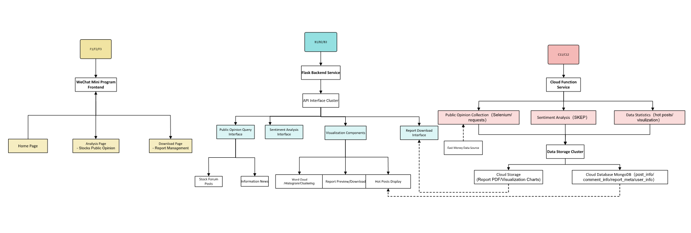
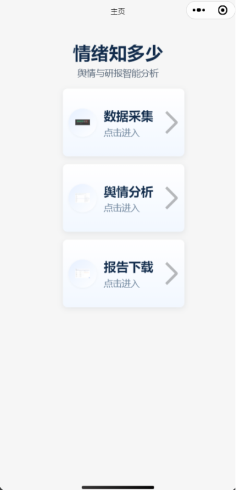
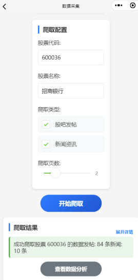
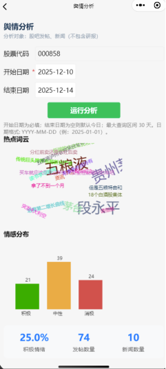
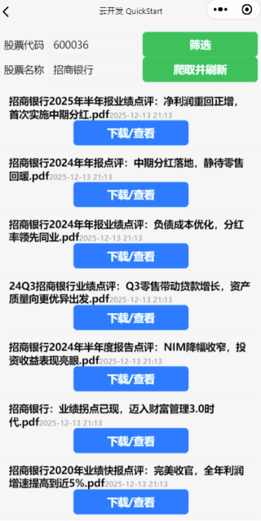

# 项目概述：
利用云计算技术，本项目基于微信云开发平台的云函数、云存储功能开发了个股情绪分析云端小程序。小程序聚焦普通股民在舆情分析中面临的效率低、操作难、成本高的核心痛点，打造覆盖“舆情采集-情感分析及可视化呈现-研报下载”的全流程服务，让非专业用户也能便捷获取高质量舆情分析支持。

## 功能简介

1. 舆情分析

    根据前端传入的股票代码及可选的时间范围参数，完成股评与新闻数据的多维度舆情分析并返回结构化结果，包括高频词云、情感倾向分布、综合情绪打分等关键指标。
2. 股评和新闻实时获取

    针对指定股票代码和名称，从东方财富网站上爬取股吧发帖与新闻资讯，并存储到数据库中。
3. 研报和财报下载

    根据前端传入的股票代码或名称，爬取研报PDF文件并存入云存储，同时提供可直接下载的临时链接。

## 目录结构：
```
miniprogram-2/
    ├── cloudfunctions/       # 云函数目录
    │   ├── advancedAnalysis/ # 高级分析云函数
    │   ├── crawlReports/     # 研报爬取云函数
    │   └── crawlStockData/   # 股评新闻爬取云函数
    ├── miniprogram/          # 小程序前端
    │   ├── components/       # 公共组件
    │   ├── images/           # 图片资源
    │   ├── pages/            # 页面目录
    │   │   ├── analysis/     # 舆情分析页
    │   │   ├── download/     # 研报下载页
    │   │   ├── index/        # 首页
    │   │   └── crawler/      # 数据采集页
    │   ├── app.js            # 小程序入口文件
    │   ├── app.json          # 全局配置
    │   └── app.wxss          # 全局样式
    ├── project.config.json   # 项目配置
    └── project.private.config.json # 项目私有配置
```
# 使用方法
## 开发环境配置：
   - 安装微信开发者工具，并登录微信开发者账号
      -下载地址：https://developers.weixin.qq.com/miniprogram/dev/devtools/download.html建议安装stable版本
   - 导入项目代码`codebase`
   - 配置云开发环境ID
      - 在微信开发者工具中，点击左侧“云开发”图标
      - 创建或选择已有环境，记录环境ID
      - 在project.config.json中设置"envId"为你的环境ID
   - 在云开发控制台中创建数据库

## 启动项目：
   - 点击微信开发者工具中的"预览"按钮
   - 或使用命令行：
     npm run dev

## 部署说明：
   - 前端代码自动打包
   - 云函数需要单独部署，在云开发控制台右击选择“上传并云端部署”

# 示例效果
<table border="0" style="border-collapse: collapse;">
  <tr>
    <td style="padding: 0; text-align: center;"></td>
    <td style="padding: 0; text-align: center;"></td>
  </tr>
  <tr>
    <td style="padding: 0; text-align: center;"></td>
    <td style="padding: 0; text-align: center;"></td>
  </tr>
</table>

# 参考文档

- [云开发文档](https://developers.weixin.qq.com/miniprogram/dev/wxcloud/basis/getting-started.html)