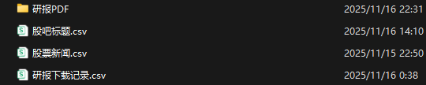
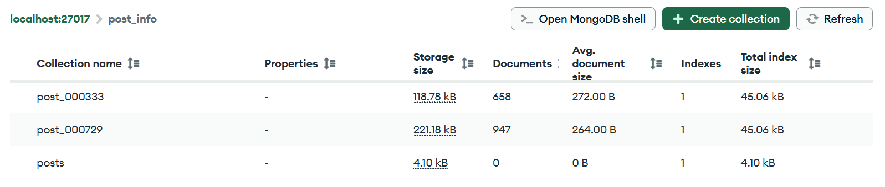

# Friendly Financial Sentiment Analysis Mini Program - Project Roadmap/Outline Framework

## I. Core Project Foundations


1. **Project Objectives and Market Positioning**: This project addresses the core pain points of retail investors in sentiment analysis—low efficiency, operational complexity, and high costs. It delivers an end-to-end service covering "sentiment data collection, sentiment analysis, visual presentation, and research report download," enabling non-professional users to easily access high-quality sentiment analysis support.

2. **List of Core Deliverables**: Local MVP scripts, MongoDB database data, WeChat Mini Program package, project report, and related technical documentation.

3. **Overall Timeline and Phase Adjustment Notes**: The total project cycle is 8 weeks, and we are currently in Week 4. The core functions of the local MVP in Phase 1 are mostly completed. Phase 2 will focus on function improvement, cloud deployment, and WeChat Mini Program development to ensure the project lands as planned.

## II. Core Functional Modules and Progress

### 1. Data Collection Module


* **Data Sources**: Post content and comments from East Money Stock Bar, news content and research report PDFs from East Money Information Platform.

* **Technical Solution**: Selenium is used to crawl dynamic pages of the stock bar, while the requests library retrieves news content and static research report PDFs. A dual-storage model is adopted: post and news data are stored in MongoDB, and research report PDFs are saved locally.

* **Completed Progress (as of Week 4)**: All three core functions—stock bar post crawling, news crawling, and research report downloading—have been fully implemented. Post and news information has been successfully stored in MongoDB, and research reports can be normally downloaded and saved locally with stable data transmission and storage performance.

### 2. Natural Language Processing (NLP) Module


* **Text Preprocessing**: Accurate filtering of meaningless vocabulary is achieved based on a custom financial stopword list. Considering practical adaptability, the originally planned financial vocabulary library construction and named entity recognition functions have been removed to focus on core preprocessing needs.

* **Sentiment Analysis**: The SKEP model is deployed to achieve precise sentiment scoring of stock comments, directly outputting sentiment tendency scores to meet users' needs for intuitive judgment.

* **Completed Progress (as of Week 4)**: The custom financial stopword list has been constructed. The SKEP model has been successfully deployed locally, enabling accurate sentiment scoring of various stock comments with analysis accuracy meeting expectations.

### 3. Visualization Module


* **Presentation Forms**:


  * Word clouds of high-frequency keywords generated via wordcloud to intuitively display sentiment hotspots;

  * Sentiment distribution histograms drawn with matplotlib to clearly show the proportion of comments with different sentiment tendencies;

  * Topic clustering scatter plots generated using K-Means algorithm combined with TF-IDF technology to realize classified presentation of similar sentiment topics.

* **Completed Progress (as of Week 4)**: All three functions—word cloud generation, sentiment distribution histogram drawing, and topic clustering scatter plot generation—have been fully developed. Intuitive and easy-to-understand visualization charts can be quickly output based on NLP analysis results, supporting users in efficiently interpreting sentiment data.

### 4. Research Report Download Module


* **Function Logic**: Users can filter target research reports from the East Money Information Platform, with local storage for downloaded files (storage path to be configured).

* **Completed Progress (as of Week 4)**: The research report filtering and downloading functions have been fully implemented. Users can quickly locate target research reports through filtering conditions, successfully obtain PDF files, and save them locally in the /data directory without download failures or format errors.

### 5. WeChat Mini Program Functional Technical Roadmap


* **Frontend Architecture**: Developed based on WeChat Mini Program's native framework (WXML/WXSS/JS), with technical planning for core pages as follows:


  * **Homepage**: Displays popular sentiment content by calling cloud interfaces to pull post and news data from MongoDB; provides core function entrances including customized stock sentiment query and research report download for quick user navigation.

  * **Analysis Page**: Supports user parameter settings (stock code and time range filtering); loads visualization results with integrated components such as word clouds, histograms, and clustering plots; synchronously displays sentiment scoring results from the SKEP model to realize one-stop presentation of analysis data.

  * **Download Page**: Displays research report lists with filtering options by industry and release time; enables online PDF preview via the Mini Program's built-in preview component; synchronizes local research reports by calling cloud storage interfaces to complete local download operations.

* **Backend Interaction**: Uses the Flask framework to encapsulate REST APIs, covering core interfaces for sentiment analysis triggering, MongoDB data query, and research report download. Leverages Tencent Cloud Development services to store user-related data through cloud databases and support the operation of core backend logic via cloud functions, ensuring system stability and scalability.

## III. Implementation Steps

### 1. Phase 1: Local MVP (Weeks 1-4) - Completed/Remaining Task Sorting


* **Completed Tasks**: Core work including data collection (stock bar, news, research reports), MongoDB data storage (posts, news), NLP preprocessing with SKEP sentiment analysis, and full-featured visualization development.

* **Remaining Tasks (Week 4)**: Promote local function integration by writing the main.py program to realize one-click operation of the entire "collection-analysis-visualization" process, improving operational convenience.

### 2. Phase 2: Cloud Deployment and Mini Program Development (Weeks 5-8) - Key Task Planning


* **Week 5**: Complete Tencent Cloud development environment configuration, migrate data from MongoDB to cloud databases, and transform local collection and analysis scripts into cloud functions to adapt to the cloud operating environment.

* **Week 6**: Conduct Flask backend API development (covering core interfaces for sentiment query, sentiment analysis result return, and research report download); implement user permission management functions to ensure user data security and experience.

* **Week 7**: Complete the development of the Mini Program's homepage, analysis page, and download page; promote interactive debugging between the frontend and backend APIs to resolve potential issues in data transmission and function response.

* **Week 8**: Conduct Mini Program user experience testing, focusing on compatibility and response speed; optimize the system based on test findings; complete the project report to summarize achievements and experiences throughout the project lifecycle.

## Guidences
### Preparations
#### Install project dependencies
```bash
pip install -r requirements.txt
```
#### Install MongoDB

- Download MongoDB: <https://www.mongodb.com/docs/manual/tutorial/install-mongodb-on-os-x/>
- Install Mongosh: <https://www.mongodb.com/try/download/shell>
- Install MongoDB Compass (GUI): <https://www.mongodb.com/try/download/compass>

#### Install WebDriver

Download the Chromedriver that matches your Chrome version. Update Chrome if necessary and get the stable Chromedriver here: <https://googlechromelabs.github.io/chrome-for-testing/#dev>

#### Download the SKEP model

Download and extract the SKEP package to `model/ernie_skep_sentiment_analysis`<https://bj.bcebos.com/paddlehub/paddlehub_dev/ernie_skep_sentiment_analysis_1.0.1.tar.gz>

### Main Features

#### Crawlers (posts, comments, news, reports)

`crawlers.py` implements four crawler classes:

- `PostCrawler`: scrapes stock-bar posts and saves them to MongoDB
- `CommentCrawler`: scrapes comments linked to posts and saves them to MongoDB
- `NewsCrawler`: searches for and saves company-related news to MongoDB
- `ReportCrawler`: searches for and downloads research report PDFs to local storage

See `examples/run_crawler_posts_news_report.ipynb` for usage examples. Scraped output is saved under the `data/` directory, for example:



Posts and comments are stored in MongoDB, for example:




#### NLP analysis

- i. Sentiment analysis

Sentiment scoring uses `paddlehub` to deploy pre-trained sentiment models. If you have not pre-downloaded the model, point `hub.Module` to the model directory or use the model `name` parameter:

```python
senta = hub.Module(directory="model/ernie_skep_sentiment_analysis")
texts = data_raw['title'].tolist()
res = senta.predict_sentiment(texts, use_gpu=False)
data_raw['pos_p'] = [x['positive_probs'] for x in res]
```

- ii. Visualization

Text preprocessing uses `jieba` for tokenization, stopword removal and POS filtering. TF-IDF and K-Means are used for topic clustering and keyword extraction. See `examples/run_mongo_NLP.ipynb` for examples.

